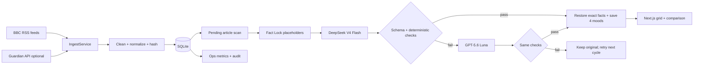

# Mood News Grid

Прототип новостной страницы, где **один и тот же набор реальных новостей** можно читать в четырёх эмоциональных режимах:

- `neutral` — нейтрально;
- `hopeful` — конструктивно и сдержанно оптимистично;
- `concerned` — обеспокоенно, но без нагнетания новых рисков;
- `ironic` — с лёгкой ситуационной иронией, без насмешки над людьми и трагедиями.

Главный принцип продукта: **AI меняет подачу, а код контролирует фактические якоря**. Результат модели не публикуется автоматически. Он проходит строгую JSON-проверку и детерминированный Fact Lock. При сбое DeepSeek или при провале проверки запрос повторяется через GPT‑5.6 Luna.

Репозиторий рассчитан как сильная стартовая база для тестового задания на 3 дня: не production-медиаплатформа, а целостный vertical slice, в котором видны работа с реальными данными, архитектурные решения, AI routing, валидация, хранение, тестирование и объяснимость.

---

## 1. Что покрыто из задания

| Требование | Реализация в проекте |
|---|---|
| Минимум 10 реальных новостей | BBC RSS подключён без ключа; Guardian Open Platform подключается дополнительно |
| Сохранение новостей | SQLite: текущая проекция, сырые payloads и immutable snapshots версий |
| Новости гридом | Главная страница `/` и `src/components/news-grid.tsx` |
| Переключатель настроения | Глобальный `MoodSwitcher`; выбранный mood хранится в URL |
| Исходный и переписанный текст рядом | `/news/[id]`, компонент `ArticleComparison` |
| Ссылка на оригинал | `canonical_url` хранится в БД и показывается на карточке и странице сравнения |
| Нельзя писать версии вручную | Все варианты создаются через OpenRouter и сохраняются с model/prompt metadata |
| Сохранение имён, дат, чисел, мест и цитат | Fact Lock: извлечение → placeholders → генерация → детерминированная проверка → восстановление |
| Понятное происхождение данных | Источник, время публикации, время загрузки, raw payload и snapshots |
| Объяснение AI | README, `docs/AI_PIPELINE.md`, `docs/FACT_LOCK.md`, экран `/about` |
| Проверяемый подход | Unit/integration tests, model benchmark, ops-экран и audit tables |

---

## 2. Что уже лежит в стартовом репозитории

- Next.js App Router интерфейс и HTTP API.
- Отдельный долгоживущий Node worker.
- Независимый poll источников каждые 5 минут; долгий AI batch не сдвигает ingestion cadence.
- BBC Top Stories, World, Technology и Business RSS.
- Опциональный Guardian Content API.
- Нормализация, sanitation, canonical URL и SHA‑256 content hash.
- Дедупликация по source item и canonical URL.
- Версионирование изменившейся записи.
- Immutable `article_snapshots` для воспроизводимости.
- Основная модель `deepseek/deepseek-v4-flash-0731` через OpenRouter.
- Fallback `openai/gpt-5.6-luna` через OpenRouter.
- Один AI-вызов сразу для четырёх moods.
- Strict JSON Schema + повторная Zod-проверка.
- Application-level fallback при provider, JSON или Fact Lock failure.
- Fact extractors для URL, цитат, денег, процентов, дат, времени, чисел и вероятных сущностей.
- Проверка отсутствующих, дублированных, неизвестных, перенесённых и переставленных placeholders.
- Повторное сканирование восстановленного текста на новые конкретные факты.
- Ограничение длины rewrite.
- Дневной лимит AI-расходов.
- Запись model, tokens, reasoning tokens, latency, cost и ошибок.
- Экран `/ops` с operational evidence.
- Unit-, integration- и E2E-заготовки.
- Сравнительный benchmark DeepSeek и Luna на одинаковых реальных новостях.
- Docker Compose, CI, migrations, health endpoint и подробная документация.

---

## 3. Почему стек именно такой

### Next.js + TypeScript

За три дня важно быстро собрать убедительный интерфейс, server-side чтение данных, API и deployment unit без отдельного фронтенд-репозитория. При этом domain, ingestion, AI и persistence разделены по модулям, а не смешаны с React-компонентами.

### SQLite + `better-sqlite3`

Для тестового задания SQLite даёт лучший баланс:

- запускается без отдельного сервера;
- легко показать, где лежат данные;
- поддерживает транзакции, WAL и индексы;
- база является одним переносимым файлом;
- быстро поднимается на чистой машине и в Docker;
- не отнимает время у основного AI/data flow.

Для production с несколькими worker-репликами предусмотрен понятный путь к PostgreSQL: `docs/POSTGRES_MIGRATION.md`.

### Отдельный worker

Импорт и AI не должны зависеть от HTTP-запроса пользователя. Worker запускает два независимых цикла:

1. ingestion сразу импортирует новости и затем повторяется каждые 5 минут;
2. rewrite runner независимо ищет статьи без полного набора accepted rewrites;
3. rewrite runner запускает DeepSeek → Fact Lock → Luna fallback;
4. долгий AI batch не задерживает очередной RSS/API poll;
5. оба цикла защищены отдельными job locks и корректно завершаются по SIGTERM.

Web-процесс остаётся быстрым и показывает последние сохранённые данные даже при временной недоступности источника или AI.

### OpenRouter

Один API-клиент позволяет переключать модели через environment. В коде модель не захардкожена в бизнес-логике.

---

## 4. Архитектура



Граница ответственности:

```text
UI / API
  ↓
Application modules
  ↓
Domain contracts
  ↓
Adapters: SQLite, RSS/API, OpenRouter
```

Полное объяснение: [`docs/ARCHITECTURE.md`](docs/ARCHITECTURE.md).

Фактически выполненные проверки и ограничения текущей песочницы: [`docs/VALIDATION_REPORT.md`](docs/VALIDATION_REPORT.md).

---

## 5. Быстрый запуск

### Требования

- Node.js 22+;
- npm;
- интернет для первого импорта и AI;
- OpenRouter API key для emotional rewrites;
- Docker — необязательно.

### Локальный запуск

```bash
cp .env.example .env
```

Минимально заполните:

```dotenv
OPENROUTER_API_KEY=ваш_ключ
CRON_SECRET=длинная-случайная-строка
```

Guardian необязателен:

```dotenv
GUARDIAN_API_KEY=
```

Установите зависимости и выполните первый полный проход:

```bash
npm install
npm run bootstrap
```

`bootstrap`:

1. создаёт SQLite-файл;
2. применяет migrations;
3. импортирует реальные новости;
4. если задан OpenRouter key — создаёт rewrites для первой пачки.

Запустите web:

```bash
npm run dev
```

Во втором терминале запустите scheduler:

```bash
npm run worker
```

Откройте:

```text
http://localhost:3000
```

### Запуск через Docker Compose

```bash
cp .env.example .env
# заполнить OPENROUTER_API_KEY и CRON_SECRET
docker compose up --build
```

Compose поднимает два процесса:

- `web` — интерфейс и API;
- `worker` — независимый импорт каждые 5 минут и AI-обработка по отдельному минутному cadence.

SQLite и отчёты хранятся в именованных Docker volumes.

---

## 6. Основные команды

```bash
npm run dev                 # Next.js web
npm run dev:worker          # worker в watch mode
npm run worker              # постоянный worker
npm run worker:once         # один ingest + rewrite cycle и выход

npm run bootstrap           # migrate + real import + rewrites
npm run ingest              # только один реальный импорт
npm run rewrite             # обработать pending articles
npm run rewrite -- --limit=5

npm run db:migrate
npm run db:seed             # зарегистрировать настроенные источники
npm run db:inspect
npm run db:reset -- --yes

npm run verify:models       # проверить model IDs для API key
npm run evaluate:ai         # DeepSeek/Luna benchmark
npm run evaluate:ai -- --limit=10
npm run report              # evidence report из audit tables
npm run export:data         # экспорт API-данных при запущенном web

npm run check:architecture
npm run check:imports
npm run check:syntax
npm run typecheck
npm run lint
npm test
npm run test:e2e
npm run check
npm run build
npm run smoke               # при запущенном web
```

---

## 7. Environment configuration

Главные параметры находятся в `.env.example`.

### Приложение и база

```dotenv
APP_URL=http://localhost:3000
DATABASE_PATH=./data/mood-news.db
DEFAULT_MOOD=neutral
NEWS_PAGE_SIZE=24
```

### Scheduler

```dotenv
INGEST_INTERVAL_MS=300000
REWRITE_INTERVAL_MS=60000
REWRITE_BATCH_SIZE=20
WORKER_RUN_ONCE=false
```

### Источники

```dotenv
BBC_ENABLED=true
BBC_RSS_FEEDS=https://feeds.bbci.co.uk/news/rss.xml,...
GUARDIAN_ENABLED=true
GUARDIAN_API_KEY=
GUARDIAN_PAGE_SIZE=20
```

### AI routing

```dotenv
OPENROUTER_API_KEY=
OPENROUTER_BASE_URL=https://openrouter.ai/api/v1
AI_PRIMARY_MODEL=deepseek/deepseek-v4-flash-0731
AI_FALLBACK_MODEL=openai/gpt-5.6-luna
AI_REASONING_ENABLED=false
AI_REASONING_EFFORT=low
AI_MAX_OUTPUT_TOKENS=1800
AI_REQUEST_TIMEOUT_MS=45000
AI_MAX_PROVIDER_RETRIES=1
AI_RETRY_BASE_DELAY_MS=600
AI_PROMPT_VERSION=mood-v1
AI_TEMPERATURE=0.35
```

### Safety и стоимость

```dotenv
MAX_ARTICLE_SUMMARY_CHARS=1800
MIN_REWRITE_LENGTH_RATIO=0.45
MAX_REWRITE_LENGTH_RATIO=2.4
MAX_DAILY_AI_COST_USD=2.00
```

---

## 8. End-to-end data flow

### 8.1 Import

1. Registry создаёт BBC adapters и, при наличии ключа, Guardian adapter.
2. Каждый adapter возвращает единый `RawNewsItem`.
3. HTML удаляется, whitespace нормализуется.
4. URL допускается только с `http/https`, tracking-параметры удаляются.
5. Title/summary проходят length limits.
6. Вычисляется content hash.
7. Запись дедуплицируется по `(source_id, source_item_id)` и canonical URL.
8. Новая статья получает `version=1` и snapshot.
9. Изменившаяся статья получает новую version и immutable snapshot.
10. Старые rewrites этой статьи переводятся в `stale`.

AI не вызывается при каждом poll. Неизменившаяся статья только обновляет `fetched_at`.

### 8.2 Protection

Для title и summary независимо извлекаются конкретные факты. Например:

```text
NASA approved a $12.5 million mission on August 14, 2026.
```

становится:

```text
[[FACT_001]] approved a [[FACT_002]] mission on [[FACT_003]].
```

Ledger хранит точные значения, поле, offsets и extractor.

### 8.3 Generation

DeepSeek получает только protected title/summary и инструкции для всех четырёх moods. Ответ должен соответствовать strict JSON Schema:

```json
{
  "variants": [
    { "mood": "neutral", "title": "...", "summary": "..." },
    { "mood": "hopeful", "title": "...", "summary": "..." },
    { "mood": "concerned", "title": "...", "summary": "..." },
    { "mood": "ironic", "title": "...", "summary": "..." }
  ]
}
```

### 8.4 Deterministic gate

Для каждого variant проверяется:

- каждый expected placeholder существует;
- каждый существует ровно один раз;
- не появилось неизвестных placeholders;
- placeholder не перемещён между title и summary;
- после восстановления не появились новые числа, даты, деньги, проценты, цитаты, URL или высокоуверенные named entities;
- rewrite не стал аномально коротким или длинным;
- модель не вернула meta-commentary.

Если хотя бы один из четырёх вариантов не прошёл, весь ответ DeepSeek отклоняется.

### 8.5 Fallback

Luna вызывается при любом из следующих событий:

- timeout;
- OpenRouter/provider error;
- rate limit после короткого transport retry;
- пустой ответ;
- malformed JSON;
- schema mismatch;
- отсутствующий mood;
- Fact Lock rejection.

Luna проходит **те же проверки**. Fallback не означает доверие к более дорогой модели.

### 8.6 Persistence

Только полностью проверенный batch сохраняется как четыре `validated` rewrites. В UI оригинал остаётся доступным всегда.

Подробнее: [`docs/AI_PIPELINE.md`](docs/AI_PIPELINE.md) и [`docs/FACT_LOCK.md`](docs/FACT_LOCK.md).

---

## 9. Хранение данных

SQLite-файл по умолчанию:

```text
./data/mood-news.db
```

Таблицы:

| Таблица | Назначение |
|---|---|
| `sources` | Конфигурация источников |
| `ingestion_runs` | Результат каждого общего poll |
| `ingestion_source_runs` | Результат poll по отдельному источнику |
| `news_articles` | Текущая нормализованная версия статьи |
| `article_snapshots` | Immutable raw + normalized snapshot каждой changed version |
| `protected_facts` | Fact ledger и placeholders |
| `rewrites` | Принятые эмоциональные версии |
| `validation_runs` | Детерминированные verdicts и причины |
| `ai_runs` | Модель, роль, tokens, cost, latency и ошибки |
| `job_locks` | Межпроцессные locks для ingest/rewrite cycle |
| `app_events` | Небольшой operational event log |
| `schema_migrations` | Применённые SQL migrations |

Схема: [`docs/DATA_MODEL.md`](docs/DATA_MODEL.md).

---

## 10. Почему fallback реализован в приложении

Provider-level failover умеет переключиться при недоступности endpoint, но он не знает, что формально успешный HTTP 200 нарушил бизнес-инвариант, например:

- удалил `[[FACT_004]]`;
- продублировал дату;
- добавил `99%`;
- переместил имя из title в summary;
- вернул только три moods.

Поэтому routing выглядит так:

```text
DeepSeek response
  → parse/schema
  → Fact Lock
  → accept OR Luna
```

Это одна из центральных инженерных демонстраций проекта.

---

## 11. UI

### `/`

- общий mood switcher;
- responsive grid;
- источник и время;
- original fallback, если rewrite ещё не готов;
- Fact Lock status;
- переход к сравнению.

### `/news/[id]`

- original и rewrite рядом;
- переключение mood;
- source link;
- модель и prompt version;
- список защищённых фактов;
- ручная генерация, если article ещё pending.

### `/ops`

- active articles;
- validated rewrites;
- AI requests/failures/cost/latency за 24 часа;
- validation pass rate;
- последняя ingestion run;
- распределение статей по источникам;
- текущий primary/fallback route.

### `/about`

Короткое объяснение метода и честных ограничений для проверяющего.

---

## 12. API

Публичное чтение:

```text
GET /api/health
GET /api/news?mood=neutral&limit=24&offset=0
GET /api/news/:id?mood=concerned
GET /api/ops/summary
```

Генерация одной статьи:

```text
POST /api/news/:id/rewrite
```

Route ограничен простым rate limit и общим дневным AI budget.

Защищённые job endpoints:

```text
POST /api/jobs/ingest
POST /api/jobs/rewrite-pending?limit=20
Authorization: Bearer <CRON_SECRET>
```

Подробнее: [`docs/API.md`](docs/API.md).

---

## 13. Тестирование

### Unit

- normalizer;
- deduplication;
- number parsing;
- JSON extraction;
- fact extractors;
- placeholders;
- validator;
- model routing и fallback.

### Integration

- SQLite migrations;
- source persistence;
- idempotent article upsert;
- changed content → new version + snapshot;
- cross-process job locks.

### E2E

- главная страница;
- health API;
- desktop/mobile profiles.

### Реальный AI benchmark

```bash
npm run ingest
npm run evaluate:ai -- --limit=10
```

Для каждой модели отчёт сохраняет:

- pass/fail Fact Lock;
- average score;
- latency;
- input/output tokens;
- фактический OpenRouter cost;
- причины rejection.

Benchmark не запускается в обычном CI, потому что он платный и недетерминированный.

Стратегия: [`docs/TEST_STRATEGY.md`](docs/TEST_STRATEGY.md).

---

## 14. Реализация за 3 дня

Коротко:

### День 1 — данные и видимый продукт

- база и migrations;
- BBC adapters;
- import/normalize/hash/upsert/snapshots;
- реальный grid;
- original links;
- responsive UI.

**Контрольная точка:** к вечеру без AI видны минимум 10 реальных новостей.

### День 2 — AI и fail-closed validation

- Fact Lock;
- strict schema;
- DeepSeek;
- Luna fallback;
- persistence;
- comparison screen;
- unit tests.

**Контрольная точка:** минимум 10 статей имеют 4 validated moods.

### День 3 — доказательства качества

- ops screen;
- benchmark;
- source/error handling;
- Docker clean run;
- CI;
- README;
- screenshots;
- demo rehearsal.

Полный почасовой план: [`docs/FINAL_IMPLEMENTATION_PLAN.md`](docs/FINAL_IMPLEMENTATION_PLAN.md) и [`docs/THREE_DAY_PLAN.md`](docs/THREE_DAY_PLAN.md).

---

## 15. Что показать на защите

1. Открыть нейтральный grid с реальными BBC/Guardian links.
2. Переключить один и тот же набор на concerned и ironic.
3. Открыть comparison.
4. Показать точные placeholders и значения.
5. Запустить тест, где добавлен `99%`, и показать rejection.
6. Показать `ModelRouter`: DeepSeek → validation → Luna.
7. Открыть `/ops`: данные, стоимость и pass rate.
8. Показать snapshot/version и AI audit в SQLite.
9. Завершить честными ограничениями, а не обещанием абсолютной истинности.

Сценарий: [`docs/DEMO_SCRIPT.md`](docs/DEMO_SCRIPT.md).

---

## 16. Что сознательно не включено

Чтобы не сорвать срок, в MVP нет:

- full article scraping;
- обхода paywall;
- пользователей и авторизации;
- vector DB/RAG;
- сложного NER;
- автоматического фактчекинга источника по внешним базам;
- гарантии semantic equivalence;
- Kafka/Redis;
- Kubernetes;
- десятков moods;
- генеративных изображений;
- production legal/licensing review.

Полный список: [`docs/LIMITATIONS.md`](docs/LIMITATIONS.md).

---

## 17. Production upgrade path

1. SQLite → PostgreSQL.
2. Durable processing queue с per-article attempts/backoff.
3. Несколько workers с `FOR UPDATE SKIP LOCKED`.
4. Source health и alerting.
5. Multilingual NER.
6. Sensitivity classifier и отключение irony для tragedy/violence.
7. Semantic entailment guard на выбранной модели.
8. Prompt/model canary evaluation.
9. OpenTelemetry.
10. Source licensing review и retention policy.

Маршрут миграции: [`docs/POSTGRES_MIGRATION.md`](docs/POSTGRES_MIGRATION.md).

---

## 18. Карта файлов

Подробное назначение каждого слоя и главных файлов:

[`docs/FILE_MAP.md`](docs/FILE_MAP.md)

Ключевые точки входа:

```text
src/app/page.tsx
src/app/news/[id]/page.tsx
src/app/ops/page.tsx
scripts/worker.ts
src/modules/ingestion/ingest-service.ts
src/modules/ai/model-router.ts
src/modules/ai/rewrite-service.ts
src/modules/fact-lock/validator.ts
src/db/repositories/news-repository.ts
migrations/0001_initial.sql
```

---

## 19. Источники и провайдеры

- BBC RSS help: `https://support.bbc.co.uk/platform/feeds/UkNews.htm`
- Guardian Open Platform: `https://open-platform.theguardian.com/`
- Guardian access: `https://open-platform.theguardian.com/access/`
- OpenRouter API docs: `https://openrouter.ai/docs/`
- DeepSeek model: `deepseek/deepseek-v4-flash-0731`
- Fallback model: `openai/gpt-5.6-luna`

Model IDs, доступность и цены могут меняться, поэтому они вынесены в environment и проверяются командой `npm run verify:models`.

---

## 20. Честная формулировка результата

Проект **не доказывает истинность исходной новости**. Он сохраняет provenance и проверяет более узкое утверждение:

> Отображаемая эмоциональная версия прошла формальные проверки сохранения конкретных фактов, найденных в импортированном source fragment.

Эта формулировка проверяема и не выдаёт вероятностную AI-обработку за абсолютную гарантию.
