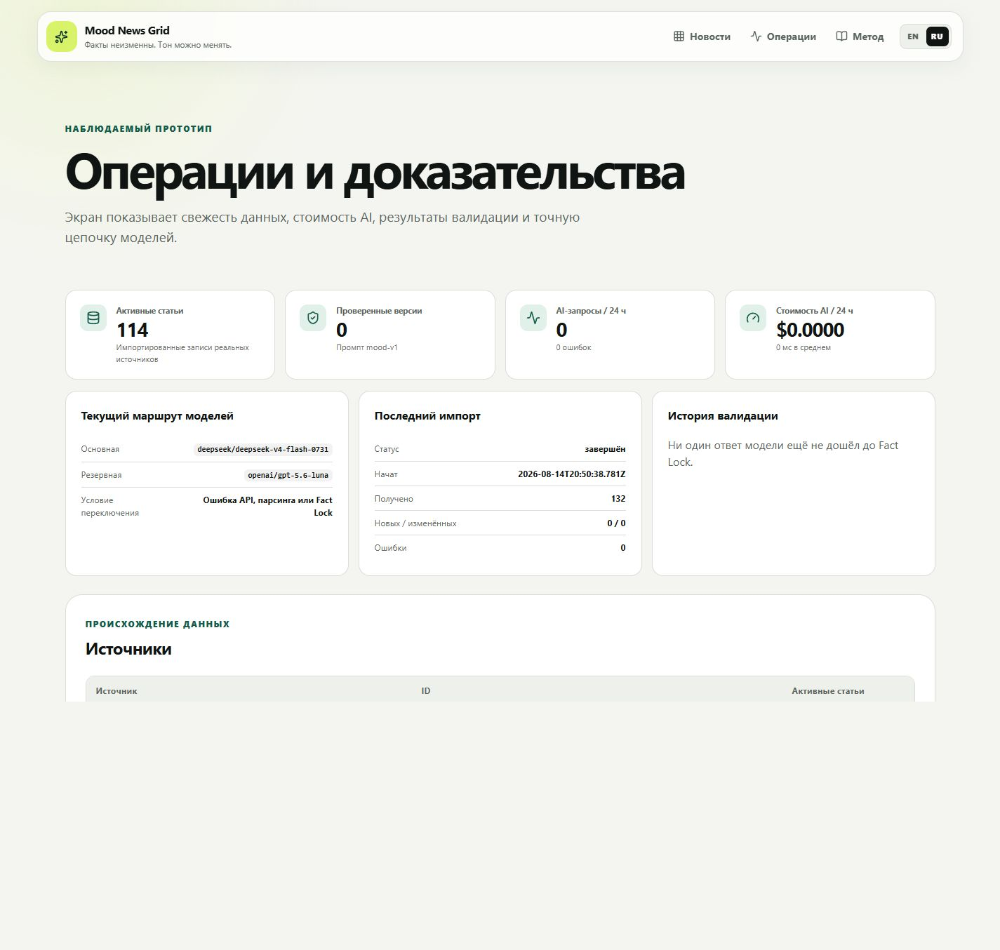

# Mood News Grid

## Как запустить

Требования: Node.js 22+, npm и интернет для загрузки реальных новостей. Для AI-версий нужен ключ OpenRouter; без него приложение работает с оригиналами, а worker явно отключает генерацию.

### Docker Compose

```bash
cp .env.example .env
```

В `.env` задайте:

```dotenv
CRON_SECRET=длинная-случайная-строка
OPENROUTER_API_KEY=ваш_ключ
WEB_BIND_ADDRESS=0.0.0.0
WEB_PORT=3000
```

Ключ Guardian необязателен:

```dotenv
GUARDIAN_API_KEY=
```

Запуск:

```bash
docker compose up -d --build
```

После прохождения healthcheck приложение доступно на `http://localhost:3000`. Compose запускает:

- `web` — интерфейс и HTTP API;
- `worker` — импорт новостей и генерацию AI-версий;
- named volumes — постоянную SQLite-базу и отчёты.

Для production Caddy принимает HTTPS и проксирует Mood News на `127.0.0.1:3001`. Конфигурация virtual hosts находится в `deploy/Caddyfile.vps`; доменное имя задаётся под конкретное окружение.

Проверка:

```bash
docker compose ps
docker compose logs -f web worker
```

### Локальный запуск

```bash
cp .env.example .env
npm ci
npm run bootstrap
npm run dev
```

Во втором терминале:

```bash
npm run worker
```

Основные проверки:

```bash
npm run check
npm run build
npm run test:e2e
```

## Что сделано

- Загрузка реальных новостей из BBC RSS; Guardian Open Platform подключается при наличии ключа.
- Постоянное хранение нормализованных новостей, raw payload и неизменяемых snapshots версий.
- Responsive grid и отдельная страница сравнения original/rewrite.
- Четыре глобальных режима: `neutral`, `hopeful`, `concerned`, `ironic`.
- Двуязычный интерфейс `RU / EN` с переключателем в верхнем баре.
- Язык интерфейса определяет язык AI-контента; настроение и язык сохраняются в URL.
- Ссылка на оригинальный источник, время публикации и время импорта.
- Fail-closed Fact Lock: непроверенный AI-текст не становится видимым как validated rewrite.
- Primary/fallback routing моделей, дневной лимит расходов и подробный журнал каждой AI-попытки.
- Отдельный worker с независимыми циклами ingestion и rewriting.
- Operations-экран `/ops` с временем последнего/следующего запроса новостей, расходами за всё время/по дням, токенами, кэшем, временем, полными промптами, исходными ответами и причинами отклонения Fact Lock; методология `/about`, health endpoint и защищённые job routes.
- SQLite migrations, Docker Compose, production Dockerfile, CI и desktop/mobile тесты.

### Скриншоты

| Лента на desktop | Сравнение и Fact Lock |
|---|---|
|  |  |

| Operations | Методология |
|---|---|
|  |  |


## Как устроена логика

### Импорт

```text
BBC RSS / Guardian API
→ единый adapter contract
→ очистка HTML и нормализация полей
→ удаление tracking-параметров из URL
→ content hash и дедупликация
→ сохранение текущей статьи и raw payload
→ snapshot при изменении source content
```

Worker запускает импорт сразу после старта и затем каждые `INGEST_INTERVAL_MS`. Неизменившаяся статья не получает новую версию и не отправляется в AI повторно. При изменении источника версия увеличивается, создаётся snapshot, а старые rewrites получают статус `stale`.

### AI rewrite

```text
article title + summary
→ извлечение имён, чисел, дат, мест, денег, URL и цитат
→ замена фактов на field-specific placeholders
→ DeepSeek через OpenRouter: языковая версия fact ledger + четыре mood-варианта
→ strict JSON Schema + Zod
→ проверка локализованных фактов + Fact Lock validation
→ при ошибке тот же процесс через Luna
→ восстановление проверенных fact values выбранного языка
→ сохранение validated batch
```

Для `en` и `ru` создаются отдельные batches. Они хранятся независимо по ключу `(article_id, mood, locale, prompt_version)`, поэтому русская версия не перезаписывает английскую. Для каждого canonical fact отдельно хранится проверенное значение языка: английский ledger совпадает с источником, русский переводит или транслитерирует имена, места, организации, даты и цитаты. URL, числа, деньги, проценты и время остаются точными. Worker обрабатывает языки поочерёдно, чтобы один locale не блокировал другой.

Русский grid показывает только статьи с validated `ru` batch текущей версии prompt. Пока перевод не прошёл проверку, английский original не выдаётся за русский контент; он остаётся доступен только как источник в сравнении.

Fact Lock проверяет:

- наличие каждого ожидаемого placeholder ровно один раз;
- полный состав и порядок locale-specific fact ledger;
- неизменность всех цифр и exact-типов при переводе фактов;
- сохранение поля и порядка защищённых фактов;
- отсутствие неизвестных placeholders;
- отсутствие новых чисел, дат, денег, процентов, цитат, URL и именованных сущностей;
- соответствие свободной прозы выбранному языку;
- допустимую длину текста и отсутствие meta-commentary модели.

Если обе модели или проверки завершились ошибкой, система сохраняет original и повторяет попытку в следующем worker cycle. Непроверенный результат не публикуется.

Очередь учитывает число AI-попыток отдельно для текущих `(prompt_version, locale)`: сначала обрабатываются ещё не проверенные статьи, поэтому одна стабильно отклоняемая новость не блокирует остальные.

Web и worker работают независимо. Межпроцессные SQLite locks не позволяют одновременно выполнять один и тот же ingestion/rewrite job.

## Где хранятся данные

По умолчанию используется SQLite:

```text
./data/mood-news.db
```

В Docker файл находится в named volume `mood_news_data` по пути `/app/data/mood-news.db`. Данные сохраняются между пересборками и перезапусками контейнеров.

Основные таблицы:

| Таблица | Что хранит |
|---|---|
| `sources` | Настроенные источники |
| `news_articles` | Текущие нормализованные статьи |
| `article_snapshots` | Историю изменившихся версий и raw payload |
| `ingestion_runs` | Результаты общих циклов импорта |
| `ingestion_source_runs` | Результаты импорта по каждому источнику |
| `protected_facts` | Fact Lock ledger и placeholders |
| `protected_fact_localizations` | Проверенное значение каждого факта для `en` и `ru`, модель и связь с source value |
| `rewrites` | Проверенные mood-версии с `locale` и prompt version |
| `validation_runs` | Verdict и детали каждой проверки |
| `ai_runs` | Каждая primary/fallback попытка: модель, locale, tokens, cache read/write, latency, cost, полные промпты, сырой ответ и структурированные причины отклонения |
| `job_locks` | Locks фоновых заданий |
| `app_events` | Operational audit events |
| `schema_migrations` | Применённые SQL migrations |

Работа с базой:

```bash
npm run db:migrate
npm run db:inspect
```

## Что использовали из AI

AI вызывается через OpenRouter:

```dotenv
AI_PRIMARY_MODEL=deepseek/deepseek-v4-flash-0731
AI_FALLBACK_MODEL=openai/gpt-5.6-luna
AI_REWRITE_LOCALES=en,ru
AI_PROMPT_VERSION=mood-v2-localized-facts
```

- DeepSeek одним structured-output запросом создаёт языковую версию fact ledger и четыре эмоциональных варианта; отдельный переводчик не используется.
- GPT-5.6 Luna используется как application-level fallback после provider-, parse-, schema- или Fact Lock-ошибки.
- Обе модели проходят одинаковую детерминированную проверку; fallback не получает дополнительных прав на публикацию.
- Модель работает с защищённым placeholder-текстом; код отдельно проверяет перевод каждого факта, цифры и exact-типы, а затем восстанавливает только принятые значения выбранного языка.
- В `ai_runs` записываются model role, locale, input/output/reasoning/cache tokens, latency, provider request ID, cost, snapshot обоих промптов, исходный ответ и структурированные причины Fact Lock. Для записей, созданных до migration `0008`, новые поля честно показываются как не записанные.
- `MAX_DAILY_AI_COST_USD` ограничивает дневные расходы.
- При пустом `OPENROUTER_API_KEY` AI runner отключается, но импорт и отображение original продолжают работать.

Проверка доступности настроенных моделей и benchmark на импортированных новостях:

```bash
npm run verify:models
npm run evaluate:ai -- --limit=3
```
