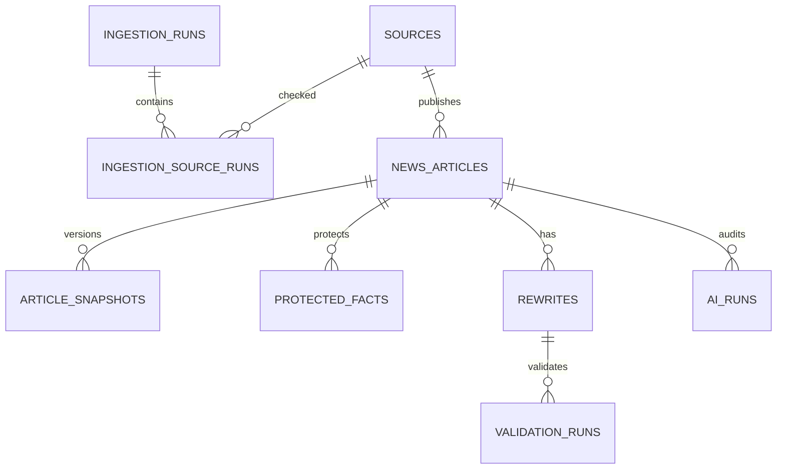

# Модель данных

## Связи



## `sources`

Registry адаптеров. URL не принимается от пользователя.

## `ingestion_runs`

Общий статус cycle и counters. `partial` означает, что хотя бы один source успешен, а хотя бы один упал.

## `ingestion_source_runs`

Диагностика каждого source внутри cycle.

## `news_articles`

Текущая normalized projection. Основные уникальности:

```text
(source_id, source_item_id)
canonical_url
```

`version` меняется только вместе с content hash.

## `article_snapshots`

Immutable история changed versions. Хранит raw payload и normalized payload, на основе которого работала система.

## `protected_facts`

Fact ledger текущей версии. Содержит точное значение, placeholder, поле, offsets и имя extractor.

## `rewrites`

Один row на article, mood и prompt version. `status=stale` исключает output после изменения source content.

## `validation_runs`

Фиксирует детерминированный verdict. Диагностика хранится JSON-массивами, чтобы быстро показать missing/duplicates/unknown/added facts.

## `ai_runs`

Каждая попытка primary/fallback. Стоимость берётся из provider response, если доступна.

## `job_locks`

Expiring locks для `ingest` и `rewrite-pending`. Они не являются полноценной message queue.

## `app_events`

Небольшой audit trail значимых application events.

## Retention

MVP автоматически ничего не удаляет: небольшой объём полезен для демонстрации. Для production нужны retention rules и backup policy.
